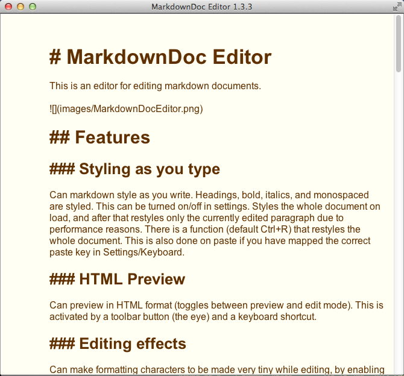

# MarkdownDoc Editor

This is an editor for editing markdown documents. 

 

## Features

### Styling as you type

Can markdown style as you write. Headings, bold, italics, and monospaced are styled. This can be turned on/off in settings. Styles the whole document on load, and after that restyles only the currently edited paragraph due to performance reasons. There is a function (default Ctrl+R) that restyles the whole document. This is also done on paste if you have mapped the correct paste key in Settings/Keyboard.

### HTML Preview

Can preview in HTML format (toggles between preview and edit mode). This is activated by a toolbar button (the eye) and a keyboard shortcut.

### Editing effects

Can make formatting characters to be made very tiny while editing, by enabling a settings option. Try it to see the effect!

### Generate PDF & HTML

Can generate both PDF and HTML from the editor window. Use toolbar button or keyboard shortcut.

### Configurable

The settings dialog allows you to configure almost anything/everything:

- All keyboard shortcuts. 

   - Don't write the keyboard shortcut in text, just press the keyboard shortcut you want to set.

   - Configured keyboard values are stored in their string representation and matched as strings. 

      - This means that the code does not have to do a humongous if statement set for each possible alternative.

      - This also means that due to differences in java implementations and versions the string representation might be Ctrl+K or ^+K. So if you change java version you might also have to update keyboard mappings in settings. 

- Margins.

- Editor font.

- Monospaced font.

- Preview font.

- Font sizes.

- Background color.

- Text color.

- Toolbar variant to use.

### Load file by drag & drop

Instead of using the GUI open dialog you can just drag and drop a file in the editor to edit it.

### Special preview drag & drop feature

While in preview mode, drag and drop a markdown file on the preview window to have it formatted and displayed. This does not affect the edit buffer in any way. Exiting preview mode will bring you back to whatever you have in the editor, and previewing again will preview the editor content. 

But by just opening an empty editor and entering a blank preview you can quickly read multiple markdown documents formatted by just dropping them on the window.

### Mac OS X Fullscreen support

When you run this editor on a Mac with Lion+ you will get a litte double arrow in the right corner of the window titlebar, which will bring upp the editor window in fullscreen. 
  
## Running

Can be run with java -jar or double clicked on. If you are using Windows 7 or 8 take a look at this page: [http://johann.loefflmann.net/en/software/jarfix/index.html]
(http://johann.loefflmann.net/en/software/jarfix/index.html). 

The executable jar have the following name: MarkdownDocEditor-n.n.n-App.jar

One or more files can be specified as arguments.

## Requirements

This requires Java 7+!

## Functions

Do note that since all keyboard actions can be configured in settings this documents the default keyboard settings. Also note that the defaults are adapted for Windows and Linux. On a mac you might want to change Ctrl to the Cmd key instead. 

	                Keyboard default    Available in toolbar
	________________________________________________________
	Save file             Ctrl+S               Yes
	Open file             Ctrl+O               Yes
	Open new window       Ctrl+N               Yes
	Insert heading        Ctrl+T               Yes
	Insert bold           Ctrl+B               Yes
	Insert italics        Ctrl+I               Yes
	Insert list           Ctrl+L               Yes
	Insert quote          Ctrl+Q               Yes
	Insert image          Ctrl+M               Yes
	Insert link           Ctrl+N               Yes
	Preview               Ctrl+F               Yes
	Generate PDF          Ctrl+P               Yes
	Generate HTML         Ctrl+H               Yes
	Settings              Ctrl+E               Yes
	Restyle document      Ctrl+R               No
	Restyle on paste (*)  Ctrl+V               No

(\*) This can be disabled by setting the key to anything other than the paste key.

## If you're on a Mac

If you are on a Mac you might want to change the keyboard mappings to use Cmd rather than Ctrl. Do note however that Cmd+H and Cmd+Q are really nasty on Mac OS X! Since these keys immedialtely kills the app these keys are impossible to set in the first place, but you will loose other unsaved settings when you try.

## Currently Missing

Fancy functions like search and replace.

Undo capability.

## Bugs

### By me

Only images with absolute path (even http: urls) are rendered in preview. Not sure I can fix this since the preview is generated in memory. I don't really know what the JTextPane sees links relative to then. Possibly if I can resolve the full path to a relative image using the same scheme as used in the PDFGenerator.

### By Oracle

- This editor uses the standard Swing component JTextPane. This is unfortunately not an optimal component. Specially for styling it gets slow for large documents. In earlier versions of Java 7 this component had a word wrap problem when deleting text either using backspace or cutting text. In that case it rerendered the text screwing up the format until new text was entered again. _As of Java 8 this bug is fixed_, but other new bugs have been added. They are however smaller and don't occur so often.

- Sometimes when the JTextPane is opened the pane will not render at all! Just increase the width of the window util text appears. Then save so that the window size for that file will be remembered. I have one and only one document for which this happens and I cannot tell what it is that causes the problem. This could be a mac only problem. 

